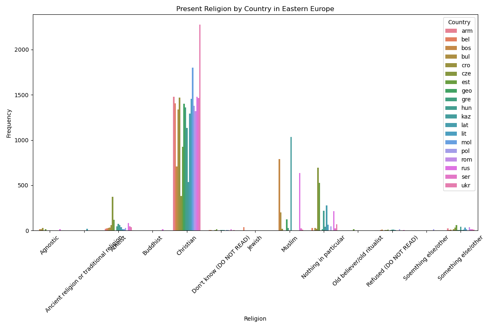
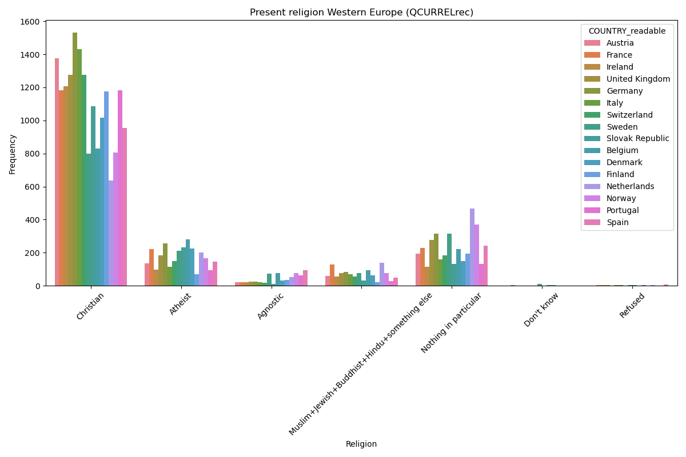
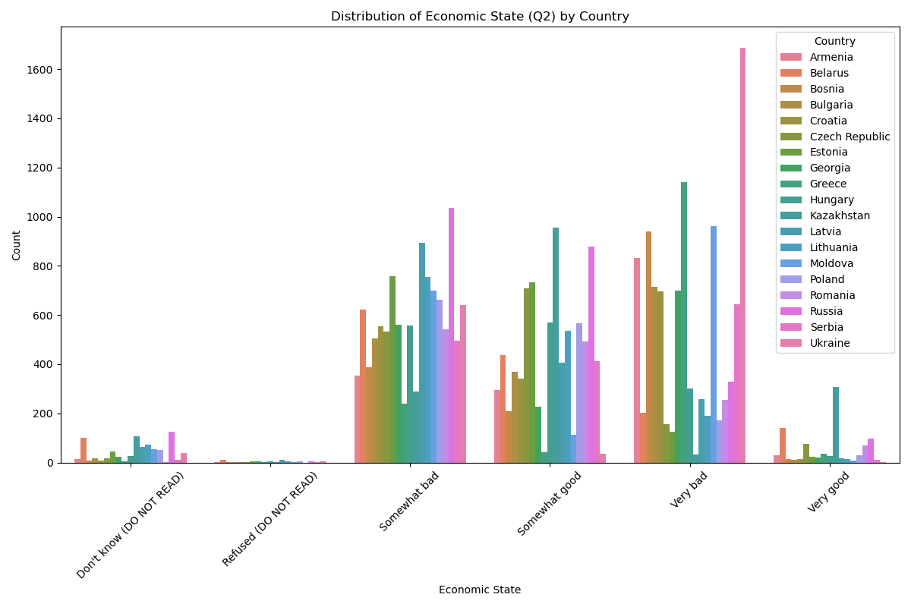
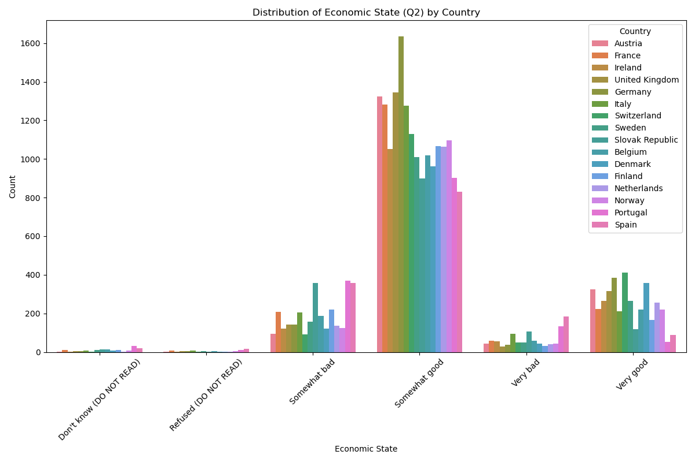

# Exploratory Data Analysis of Religions Dataset

## Overview

This document presents the findings from the exploratory data analysis of a religions datasets. The dataset contains survey answers from various countries, detailing aspects such as country of origin, description, designation, points (score), price, province, title, variety, and winery.

## Data inspection

We use two data sets: one for Central and Europe and one for Western Europe.

- Western Europe entries is: 26096
- Western Europe columns: 369

- Central and Europe entries is: 31545
- Central and Europe columns: 475

Some of those columns are specific to a country, so we will not be using the whole dataset.

## Key Visualizations and Findings

#### Eastern Europe Religion by country

- Eastern Europe is 78% Christian, 9.1% Muslin, and only 3.5% Atheist, with Ukraine being the most Christian out of all countries

#### Western Europe Religion by country

- Western Europe is 68.1% Christian, 10.7% Atheist, with Germany being the most Christian out of all countries

#### Eastern Europe vs Western Europe Economic State Perception by country

- Eastern Europe's peception of economic state is significantly lower compared to Western Europe's perception.
